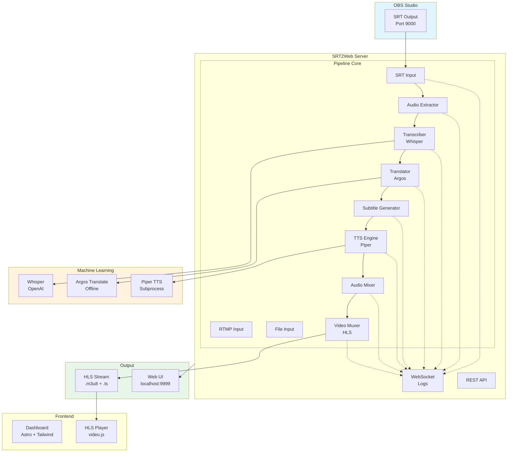
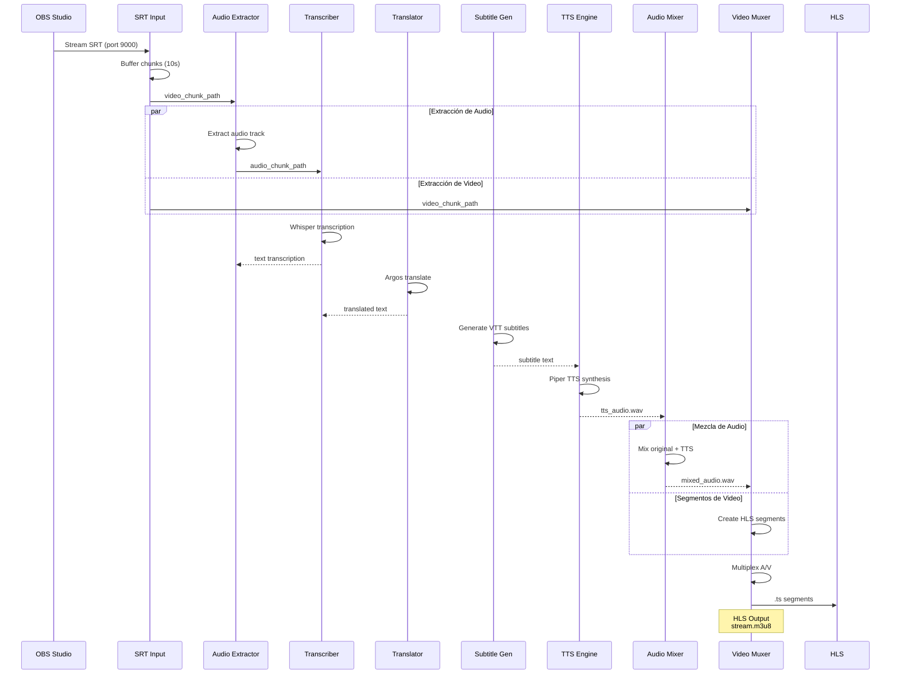
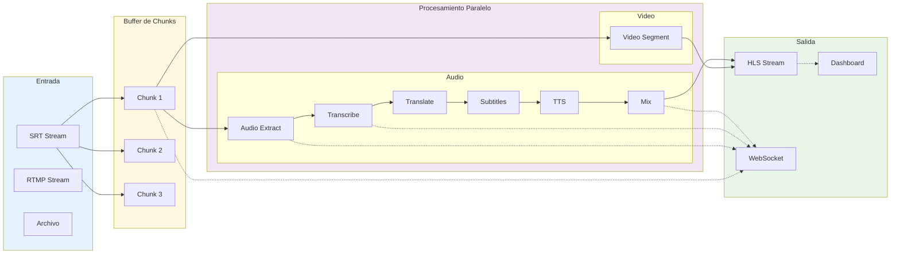
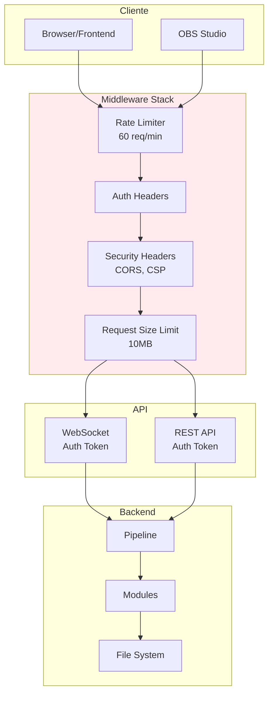
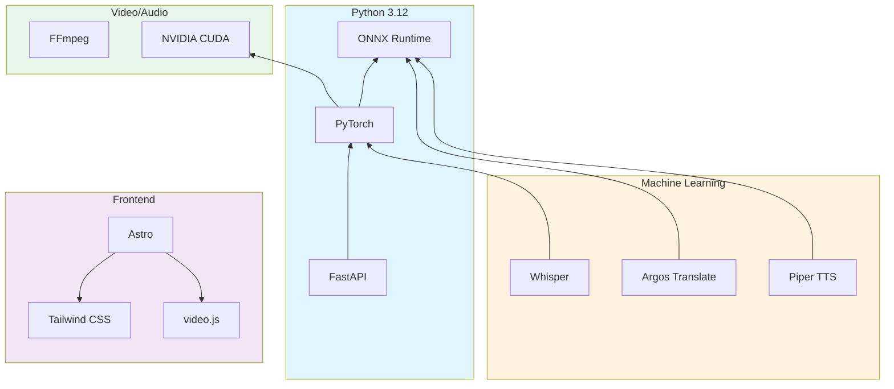

# Arquitectura - SRT2Web

## Diagrama General del Sistema



## Pipeline de Procesamiento



## Arquitectura de Módulos

```mermaid
classDiagram
    class ModuleBase {
        <<abstract>>
        +enabled: bool
        +state: ModuleState
        +initialize() None
        +process(data: PipelineData) PipelineData
        +get_status() dict
        +shutdown() None
    end

    class InputSource {
        <<interface>>
        +connect() bool
        +disconnect() None
        +read_chunk() Optional~Chunk~
    end

    class OutputSink {
        <<interface>>
        +write(data: Any) bool
        +flush() None
        +close() None
    end

    class SRTInput {
        +port: int
        +latency_ms: int
        +connect() bool
        +read_chunk() Chunk
    }

    class HLSOutput {
        +segment_duration: int
        +write(data: VideoFrame) bool
        +finalize() str
    }

    class Transcriber {
        +model: str
        +device: str
        +transcribe(audio_path: str) str
    }

    class Translator {
        +source_lang: str
        +target_lang: str
        +translate(text: str) str
    }

    class TTSEngine {
        +voice: str
        +speed: float
        +synthesize(text: str) bytes
    }

    class AudioMixer {
        +original_volume: float
        +tts_volume: float
        +mix(audio1: str, audio2: str) str
    }

    class VideoMuxer {
        +encoder: str
        +preset: str
        +mux(video: str, audio: str) str
    }

    ModuleBase <|-- SRTInput
    ModuleBase <|-- Transcriber
    ModuleBase <|-- Translator
    ModuleBase <|-- TTSEngine
    ModuleBase <|-- AudioMixer
    ModuleBase <|-- VideoMuxer

    InputSource <|-- SRTInput
    OutputSink <|-- HLSOutput
```

## Flujo de Datos



## Arquitectura de Seguridad



## Estado de Módulos

```mermaid
stateDiagram-v2
    [*] --> Idle

    state Idle {
        [*] --> Disabled
        Disabled --> Enabled: enable()
        Enabled --> Disabled: disable()
    }

    state Processing {
        [*] --> Initializing
        Initializing --> Ready: init complete
        Ready --> Processing: process start
        Processing --> Ready: process complete
        Processing --> Error: exception
        Error --> Ready: retry
    }

    Idle --> Processing: start pipeline
    Processing --> Idle: stop pipeline

    state Error {
        [*] --> Recoverable
        Recoverable --> Ready: recovery
        Recoverable --> Fatal: max retries
        Fatal --> [*]: shutdown
    }
```

## Dependencias del Sistema



## Estructura de Directorios

```
srt2web/
├── core/                    # Núcleo del sistema
│   ├── pipeline.py          # Orquestación del pipeline
│   ├── config_manager.py    # Gestión de configuración
│   ├── module_base.py       # Clase base para módulos
│   ├── ffmpeg_pool.py       # Pool de procesos FFmpeg
│   └── model_cache.py       # Cache de modelos ML
│
├── modules/                 # Módulos de procesamiento
│   ├── inputs/              # Fuentes de entrada
│   │   ├── srt_input.py     # SRT protocol
│   │   └── rtmp_input.py    # RTMP protocol
│   ├── transcriber.py       # Whisper transcription
│   ├── translator.py        # Argos translation
│   ├── tts_engine.py        # Piper TTS
│   ├── audio_mixer.py        # Mezcla de audio (numpy)
│   ├── video_muxer.py        # Multiplexación HLS
│   └── subtitle_generator.py  # Generación VTT
│
├── server/                  # Servidor HTTP
│   ├── app.py               # FastAPI app
│   ├── api_routes.py        # REST endpoints
│   ├── ws_routes.py         # WebSocket endpoints
│   └── security.py          # Middleware seguridad
│
├── frontend/                # Interfaz web
│   └── src/
│       ├── components/      # Componentes Astro
│       ├── lib/             # JavaScript modules
│       └── layouts/          # Layouts base
│
├── desktop/                 # App Electron (opcional)
├── docs/                    # Documentación MkDocs
├── tests/                   # Suite de tests
├── scripts/                 # Scripts utilitarios
└── logs/                    # Logs de aplicación
```

## Modelo de Datos

```mermaid
erDiagram
    PIPELINE {
        string id PK
        string state
        datetime start_time
        datetime end_time
    }

    MODULE {
        string name PK
        string type
        boolean enabled
        string state
        dict config
    }

    CHUNK {
        int index
        string video_path
        string audio_path
        float duration
        datetime timestamp
    }

    PIPELINE ||--o{ MODULE : contains
    PIPELINE ||--o{ CHUNK : processes

    MODULE {
        string name PK
        string type
        boolean enabled
        string state
        dict config
    }

    OUTPUT {
        string id PK
        string type
        string path
        string status
        datetime created_at
    }

    MODULE ||--o{ OUTPUT : produces