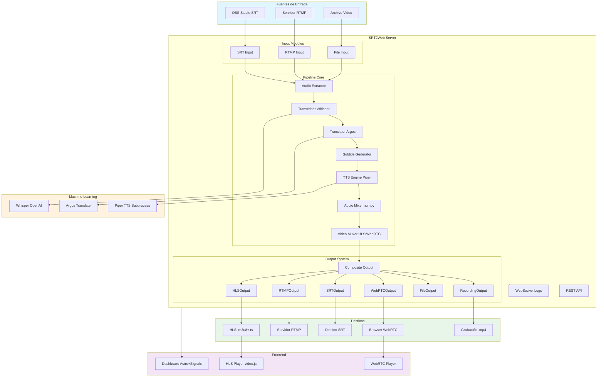
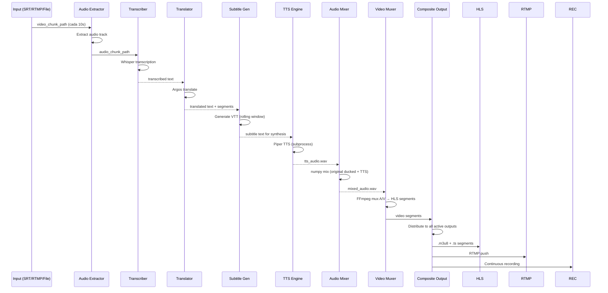
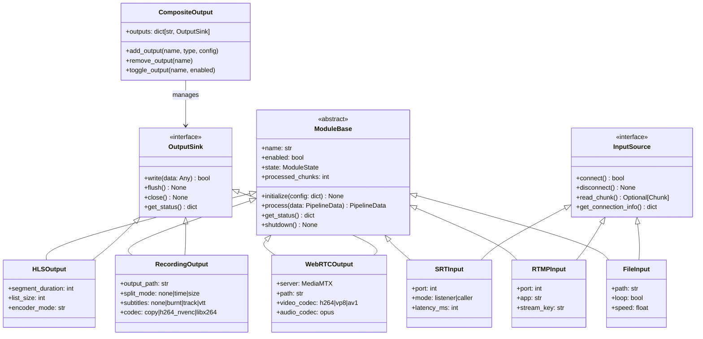
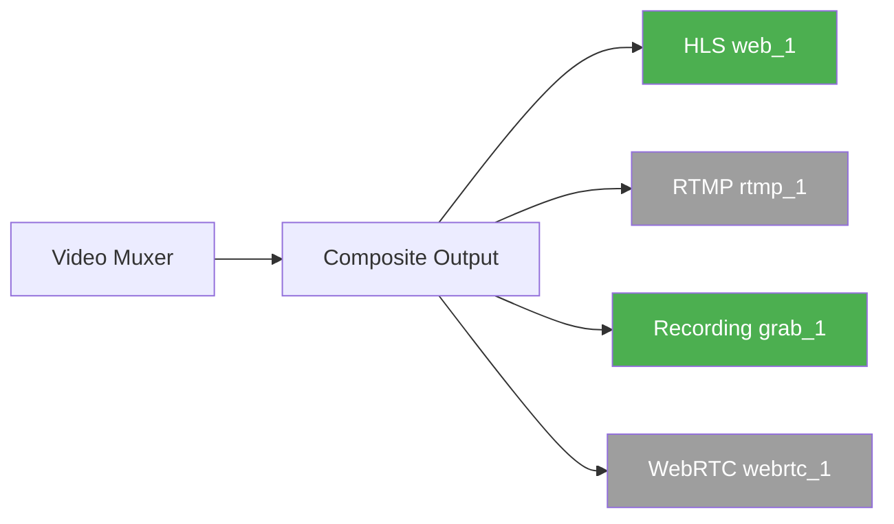
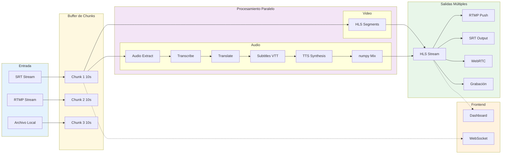
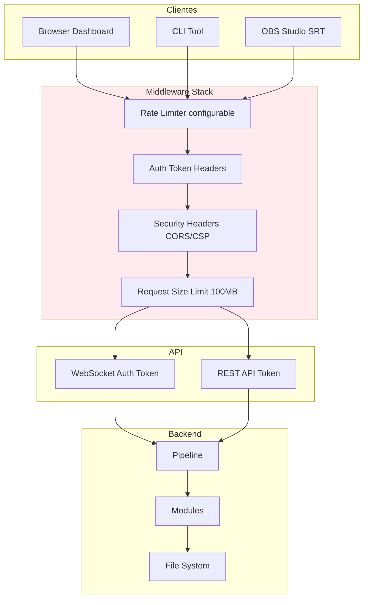
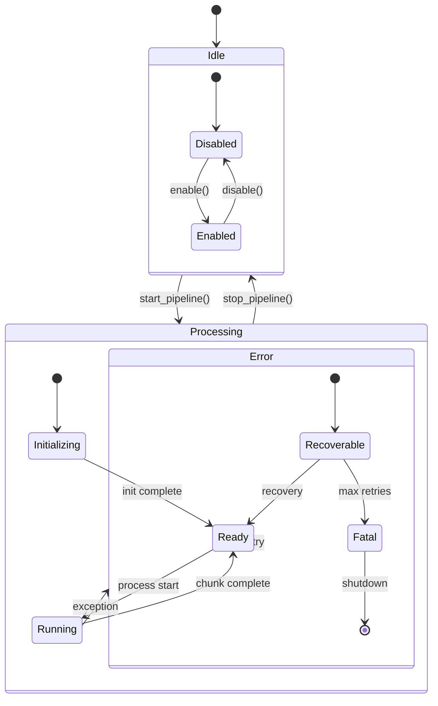
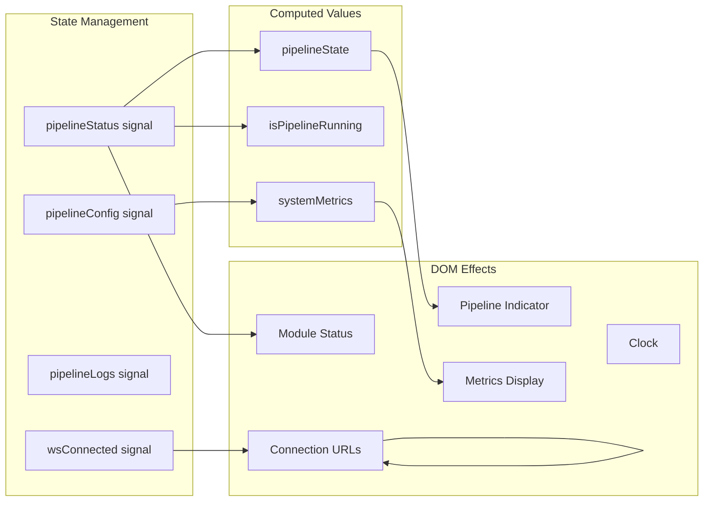
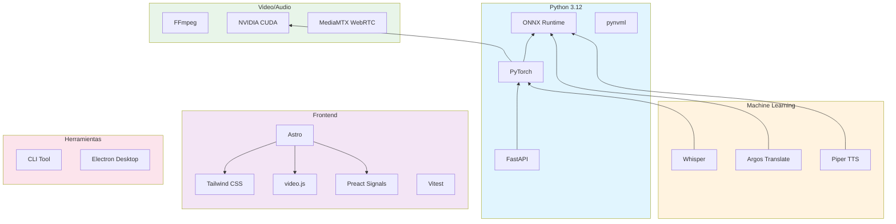
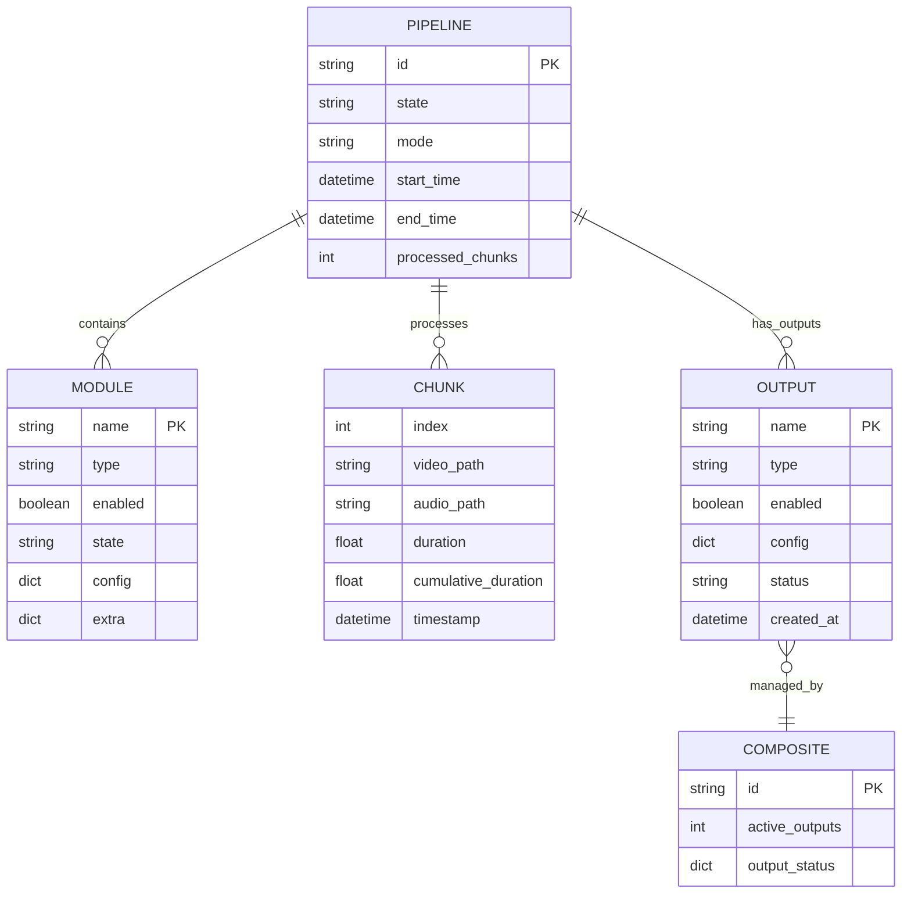

# Arquitectura - SRT2Web

## Diagrama General del Sistema



## Pipeline de Procesamiento



## Arquitectura de Módulos



## Sistema Multi-Output



El sistema de **salidas múltiples** permite distribuir el mismo stream a varios destinos simultáneamente:

| Output Type | Alias                     | Config Key         | Descripción                  |
| ----------- | ------------------------- | ------------------ | ---------------------------- |
| HLS         | `web`, `webplayer`, `hls` | `output.web`       | Streaming para navegador     |
| RTMP        | `rtmp`                    | `output.rtmp`      | Push a servidor RTMP externo |
| SRT         | `srt`                     | `output.srt`       | Output via protocolo SRT     |
| WebRTC      | `webrtc`                  | `output.webrtc`    | Streaming baja latencia      |
| Recording   | `recording`               | `output.recording` | Grabación continua a archivo |
| File        | `file`                    | `output.file`      | Guardar chunks como archivos |

**Configuración** en `config.yaml`:

```yaml
# Salida principal
output:
  type: web
  web:
    segment_duration: 4
    list_size: 6

# Salidas adicionales simultáneas
outputs:
  - name: recording_1
    type: recording
    enabled: true
    config:
      output_path: ./output/grabacion.mp4
      codec: copy
      subtitles: track # Subtítulos como pista separada
  - name: rtmp_1
    type: rtmp
    enabled: false
    config:
      url: rtmp://youtube.com/live/xxx
```

## Flujo de Datos



## Arquitectura de Seguridad



## Estado de Módulos



## Frontend: Signals & Effects



El frontend usa **Preact Signals** para gestión de estado reactivo:

- **Signals** (`store/signals.ts`): State atoms (`pipelineStatus`, `pipelineConfig`, `pipelineLogs`, `wsConnected`)
- **Computed** (`store/signals.ts`): Derived values (`pipelineState`, `isPipelineRunning`, `systemMetrics`, `connectionUrls`)
- **Effects** (`store/effects.ts`): DOM updates automáticos cuando signals cambian
- **API** (`api.ts`): HTTP calls con auth token, WebSocket management

## Pipeline Modes

| Mode              | Clase                    | Descripción                                  |
| ----------------- | ------------------------ | -------------------------------------------- |
| `sequential`      | `SequentialPipeline`     | Procesamiento chunk a chunk (menor latencia) |
| `thread_parallel` | `ThreadParallelPipeline` | Módulos en paralelo con ThreadPoolExecutor   |
| `async`           | `AsyncPipeline`          | Pipeline completamente asíncrono             |

```yaml
pipeline:
  mode: thread_parallel # sequential | thread_parallel | async
  max_concurrent_chunks: 4 # Chunks procesados simultáneamente
  chunk_duration_sec: 15 # Duración de cada chunk
  buffer_size: 2 # Buffer de chunks en memoria
```

## Dependencias del Sistema



## Estructura de Directorios

```
srt2web/
├── core/                    # Núcleo del sistema
│   ├── pipeline/            # Pipeline modes
│   │   ├── sequential.py    # Procesamiento secuencial
│   │   ├── parallel.py      # ThreadPoolExecutor
│   │   ├── async_pipeline.py # Async pipeline
│   │   ├── factory.py       # Pipeline factory
│   │   └── base.py          # Base classes
│   ├── pipeline.py          # Pipeline orchestrator
│   ├── pipeline_manager.py  # Gestión de lifecycle
│   ├── config_manager.py    # Configuración con hot-reload
│   ├── config_schema.py     # Validación de schemas
│   ├── module_base.py       # Clase base módulos
│   ├── module_interface.py  # ProcessingModule Protocol
│   ├── io_factory.py        # Factory inputs/outputs
│   ├── input_source.py      # InputSource interface
│   ├── output_sink.py       # OutputSink interface
│   ├── ffmpeg_pool.py       # Pool procesos FFmpeg
│   ├── ffmpeg_utils.py      # Utilidades FFmpeg
│   ├── model_cache.py       # Cache modelos ML
│   ├── hardware_monitor.py  # Monitor GPU/CPU/RAM
│   ├── mediarmtx_manager.py # Gestión MediaMTX WebRTC
│   ├── encoder_config.py    # Configuración encoders
│   ├── network_utils.py     # Utilidades red
│   ├── watchdog.py          # Watchdog de procesos
│   ├── security.py          # Middleware seguridad
│   ├── logging_setup.py     # Logging con file rotation
│   ├── cuda_paths.py        # CUDA path config
│   ├── constants.py         # Constantes globales
│   ├── types.py             # Tipos compartidos
│   ├── exceptions.py        # Excepciones custom
│   └── paths.py             # Path utilities
│
├── modules/                 # Módulos de procesamiento
│   ├── inputs/              # Fuentes de entrada
│   │   ├── base.py          # InputSource base
│   │   ├── srt_input.py     # SRT protocol
│   │   ├── rtmp_input.py    # RTMP protocol
│   │   └── file_input.py    # Video file input
│   ├── outputs/             # Salidas múltiples
│   │   ├── base.py          # OutputSink base
│   │   ├── hls_output.py    # HLS streaming
│   │   ├── rtmp_output.py   # RTMP push
│   │   ├── srt_output.py    # SRT output
│   │   ├── webrtc_output.py # WebRTC streaming
│   │   ├── recording_output.py # Grabación continua
│   │   ├── file_output.py   # File chunk output
│   │   └── composite_output.py # Multi-output manager
│   ├── transcriber.py       # Whisper transcription
│   ├── translator.py        # Argos translation
│   ├── tts_engine.py        # Piper/Edge TTS
│   ├── piper_loader.py      # Piper subprocess loader
│   ├── audio_extractor.py   # Audio extraction
│   ├── audio_mixer.py       # numpy audio mixing
│   ├── video_muxer.py       # HLS/WebRTC muxing
│   ├── webrtc_engine.py     # WebRTC engine
│   ├── subtitle_generator.py # VTT generation
│   └── srt_ingest.py        # SRT ingest helper
│
├── server/                  # Servidor HTTP
│   ├── app.py               # FastAPI app + GZip
│   ├── api_routes.py        # REST endpoints
│   ├── ws_routes.py         # WebSocket endpoints
│   └── security.py          # Security middleware
│
├── cli/                     # Herramienta CLI
│   ├── srt2web.py           # CLI completa (540 líneas)
│   ├── srt2web.bat          # Windows launcher
│   └── README.md            # Documentación CLI
│
├── frontend/                # Interfaz web
│   ├── src/
│   │   ├── pages/           # Rutas Astro
│   │   │   ├── index.astro       # Dashboard principal
│   │   │   ├── player.astro      # HLS Player
│   │   │   ├── webrtc-player.astro # WebRTC Player
│   │   │   └── docs/             # Documentación integrada
│   │   ├── components/      # Componentes Astro
│   │   │   ├── ui/          # UI primitives (Button, Input, etc.)
│   │   │   ├── layout/      # Layout components
│   │   │   └── docs/        # Documentation components
│   │   └── lib/             # JavaScript/TypeScript
│   │       ├── store/       # Preact Signals + Effects
│   │       ├── modules/     # UI modules (config, outputs, etc.)
│   │       ├── utils/       # Utilities (clock, format, perf)
│   │       ├── api.ts       # API client + auth
│   │       ├── types.ts     # TypeScript types
│   │       ├── constants.ts # Shared constants
│   │       └── i18n.ts      # Internationalization
│   └── ...
│
├── desktop/                 # App Electron
│   ├── src/main.js          # Electron main process
│   ├── src/preload.js       # Context bridge
│   ├── src/python/          # Python launcher
│   └── ...
│
├── docs/                    # Documentación MkDocs
├── tests/                   # Suite de tests (740 tests)
│   └── unit/                # Tests unitarios
├── scripts/                 # Scripts utilitarios
├── config/                  # Configuración
├── models/                  # Modelos ML descargados
├── output/                  # Directorio de salida
└── logs/                    # Logs de aplicación
```

## Modelo de Datos



## PipelineData

```python
@dataclass
class PipelineData:
    video_chunk_path: Optional[str] = None
    audio_chunk_path: Optional[str] = None
    mixed_audio_path: Optional[str] = None
    subtitle_path: Optional[str] = None
    chunk_index: int = 0
    duration: float = 0.0
    cumulative_duration: float = 0.0
    transcribed_text: Optional[str] = None
    translated_text: Optional[str] = None
    transcribed_segments: Optional[list] = None
    translated_segments: Optional[list] = None
    metadata: dict = field(default_factory=dict)
    extra: dict = field(default_factory=dict)
```
