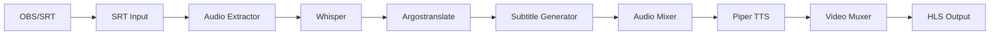

# SRT2Web

**Streaming en tiempo real con subtítulos y traducción automática**

SRT2Web es una aplicación de streaming que captura contenido en vivo, genera transcripciones automáticas usando Whisper, las traduce con Argostranslate, crea subtítulos en tiempo real y los reproduce junto con audio sintetizado mediante TTS.

## Características Principales

- **Captura en tiempo real**: Soporte para SRT, RTMP y archivos de video
- **Transcripción automática**: Whisper para reconocimiento de voz en múltiples idiomas
- **Traducción instantánea**: Argostranslate para traducción entre idiomas
- **Subtítulos en vivo**: Generación de VTT con rolling window
- **Audio sintetizado**: Piper TTS para lectura de traducciones
- **Streaming HLS**: Salidas múltiples con segmentación adaptativa
- **Dashboard web**: Interfaz moderna con Tailwind CSS
- **Soporte GPU**: Aceleración CUDA para mejor rendimiento

## Arquitectura



## Tecnologías

| Componente | Tecnología |
|------------|------------|
| Backend | Python 3.12, FastAPI, uvicorn |
| Transcripción | OpenAI Whisper |
| Traducción | Argostranslate |
| TTS | Piper (ONNX) |
| Frontend | Astro, Tailwind CSS, TypeScript |
| Streaming | FFmpeg, HLS |
| GPU | CUDA, cuBLAS, cuDNN |

## Inicio Rápido

```bash
# 1. Clonar repositorio
git clone https://github.com/BrunoJimenez73/srt2web.git
cd srt2web

# 2. Instalar dependencias
pip install -r requirements.txt

# 3. Configurar
copy config.yaml.backup config.yaml

# 4. Ejecutar
python main.py
```

Accede al dashboard en [http://localhost:9999](http://localhost:9999)

## Estados de Módulos

| Módulo | Estado | Descripción |
|--------|--------|-------------|
| SRT Input | Listo | Escucha puerto 9000 |
| Audio Extractor | Idle | Extracción de audio |
| Whisper | Idle | Transcripción IA |
| Translator | Idle | Traducción automática |
| Subtitle Gen | Idle | Generación VTT |
| Audio Mixer | Idle | Mezcla A/V |
| TTS Engine | Idle | Síntesis de voz |
| Video Muxer | Idle | Mux HLS |

## Documentación

- [Instalación](./Installation/index.md) - Guía completa de instalación
- [Arquitectura](./Architecture/index.md) - Diagrama del sistema
- [Configuración](./Configuration/index.md) - Opciones de configuración
- [Desarrollo](./Development/index.md) - Guía para contribuidores

## Licencia

MIT License - ver [LICENSE](../LICENSE)