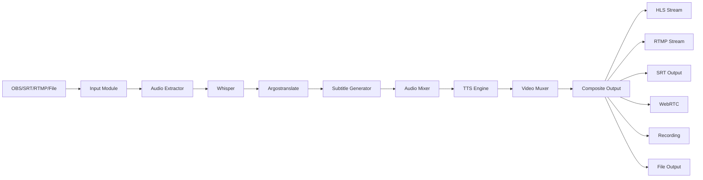

# SRT2Web

**Streaming en tiempo real con subtítulos, traducción automática y salidas múltiples**

SRT2Web es una aplicación de streaming que captura contenido en vivo (SRT, RTMP o archivos), genera transcripciones automáticas con Whisper, las traduce con Argostranslate, crea subtítulos en tiempo real y los reproduce junto con audio sintetizado mediante TTS. Soporta **múltiples salidas simultáneas** (HLS, RTMP, SRT, WebRTC, grabación local).

## Características Principales

- **Entradas múltiples**: SRT, RTMP (listener/pull) y archivos de video locales
- **Transcripción automática**: Whisper con aceleración GPU (CUDA/MPS)
- **Traducción instantánea**: Argostranslate offline entre idiomas
- **Subtítulos en vivo**: VTT con rolling window (max 50 entradas, 60s)
- **Audio sintetizado**: Piper TTS (subprocess, no bloquea event loop) + Edge TTS
- **Salidas múltiples simultáneas**: HLS, RTMP, SRT, WebRTC, grabación local, archivos
- **Grabación continua**: Con split por tiempo/tamaño y subtítulos como track
- **Pipeline paralelo**: thread_parallel, sequential y async modes
- **Dashboard web**: Astro + Tailwind CSS + TypeScript + Preact Signals
- **Soporte GPU**: CUDA (NVIDIA), MPS (Apple Silicon), fallback automático a CPU
- **CLI completa**: Control total desde terminal con modo interactivo
- **App Desktop**: Electron empaquetado (Windows/macOS/Linux)
- **Seguridad**: Rate limiting, auth tokens, CSP headers, WebSocket auth

## Arquitectura



## Tecnologías

| Componente    | Tecnología                                      |
| ------------- | ----------------------------------------------- |
| Backend       | Python 3.12, FastAPI, uvicorn                   |
| Transcripción | OpenAI Whisper                                  |
| Traducción    | Argostranslate                                  |
| TTS           | Piper (ONNX, subprocess) + Edge TTS             |
| Frontend      | Astro, Tailwind CSS, TypeScript, Preact Signals |
| Streaming     | FFmpeg, HLS, WebRTC (MediaMTX)                  |
| GPU           | CUDA 12.x, Apple MPS                            |
| Desktop       | Electron, electron-builder                      |

## Inicio Rápido

```bash
# 1. Clonar repositorio
git clone https://github.com/BrunoJimenez73/srt2web.git
cd srt2web

# 2. Instalar dependencias
python -m venv venv
venv\Scripts\activate    # Windows
pip install -r requirements.txt

# 3. Instalar FFmpeg (si no está)
winget install ffmpeg    # Windows
# brew install ffmpeg    # Mac

# 4. Ejecutar
start.bat                # Windows
# ./start_Mac.sh         # Mac Silicon
```

Accede al dashboard en [http://localhost:9999](http://localhost:9999)

## Entradas Disponibles

| Tipo     | Protocolo | Descripción                                 |
| -------- | --------- | ------------------------------------------- |
| **SRT**  | SRT v1.5  | Listener o Caller (puerto 9000 por defecto) |
| **RTMP** | RTMP      | Listener (puerto 1935) o Pull remoto        |
| **File** | Local     | Video local con loop, velocidad y seek      |

## Salidas Disponibles

| Tipo          | Alias                     | Descripción                    |
| ------------- | ------------------------- | ------------------------------ |
| **HLS**       | `web`, `webplayer`, `hls` | Streaming HLS para navegador   |
| **RTMP**      | `rtmp`                    | Push a servidor RTMP           |
| **SRT**       | `srt`                     | Output via protocolo SRT       |
| **WebRTC**    | `webrtc`                  | Streaming WebRTC baja latencia |
| **Recording** | `recording`               | Grabación continua a archivo   |
| **File**      | `file`                    | Guardar chunks como archivos   |

Puedes tener **múltiples salidas activas simultáneamente** via el sistema `outputs:` en config.yaml.

## Estados de Módulos

| Módulo              | Descripción                   | GPU      |
| ------------------- | ----------------------------- | -------- |
| SRT/RTMP/File Input | Captura de stream             | No       |
| Audio Extractor     | Extracción pista audio        | No       |
| Whisper             | Transcripción IA              | CUDA/MPS |
| Translator          | Traducción offline            | No       |
| Subtitle Generator  | VTT rolling window            | No       |
| Audio Mixer         | Mezcla numpy (original + TTS) | No       |
| TTS Engine          | Piper/Edge TTS                | CUDA     |
| Video Muxer         | HLS/WebRTC encoding           | NVENC    |

## Documentación

- [Guía de Despliegue](./deployment.md) - Instalación, OBS, troubleshooting, Docker
- [Arquitectura](./architecture.md) - Diagramas, flujo de datos, modelo de datos
- [Guía de Contribución](./contributing.md) - Setup dev, estándares, tests, PRs

## Versión

**0.6.8** - Última actualización: 2026-04-27

## Licencia

MIT License - ver [LICENSE](../LICENSE)
